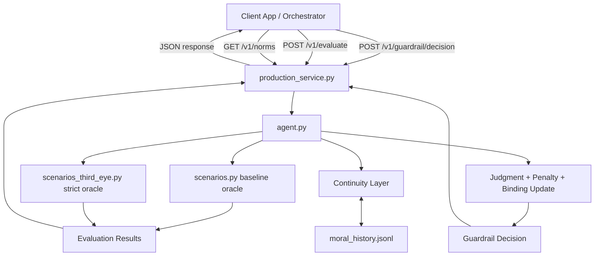
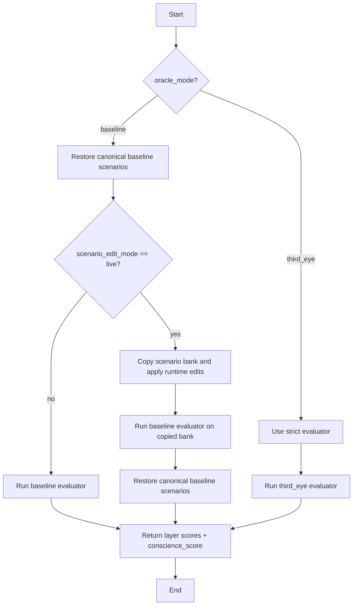
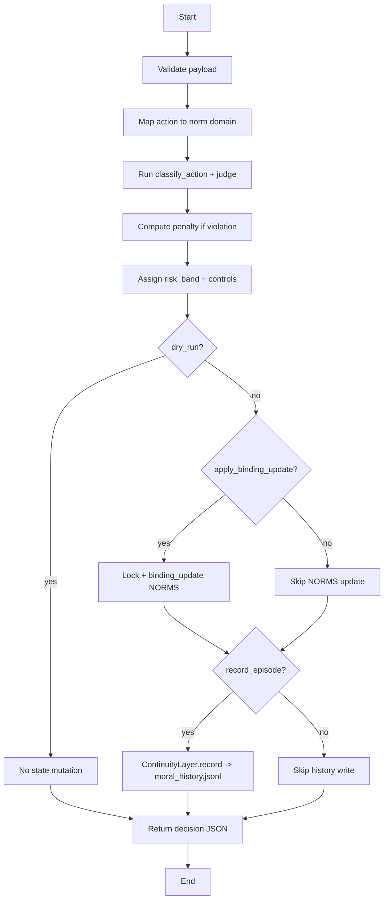

# conscience_research: SD, DFD, PFD

This document captures a production-oriented view of the current `conscience_research` system in one place.

## 1) SD (System Design)

### 1.1 Purpose

`conscience_research` provides:
- conscience evaluation (`baseline` and `third_eye` oracle modes)
- optional runtime-only scenario edit mode (baseline-only)
- production guardrail decisions via HTTP API (`production_service.py`)

### 1.2 Core modules

- `agent.py`
  - normative state model (`NORMS`)
  - judgment (`judge`, `classify_action`)
  - penalty generation (`generate_penalty`)
  - binding update (`binding_update`)
  - continuity layer (`ContinuityLayer`)
  - oracle-safe evaluation wrappers

- `scenarios.py`
  - preserved baseline oracle (`SCENARIO_BANK`)
  - fixed evaluation logic (`evaluate_conscience`)

- `scenarios_third_eye.py`
  - stricter audit evaluator (`evaluate_conscience_third_eye`)

- `production_service.py`
  - API endpoints:
    - `GET /health`
    - `GET /v1/norms`
    - `POST /v1/evaluate`
    - `POST /v1/guardrail/decision`

### 1.3 Safety and integrity controls

- Canonical baseline scenario snapshot in `agent.py`
- Baseline restore before and after runtime-edited evaluations
- Runtime scenario edits applied to copied scenario bank only
- Optional state mutation in production decision path guarded by lock

### 1.4 Storage

- in-memory:
  - normative state (`NORMS`)
  - continuity in-memory cache

- file-based:
  - `moral_history.jsonl` for continuity persistence

### 1.5 Deployment view

- Runtime: Python 3.x process
- Container: Docker (`Dockerfile`)
- Orchestration: Docker Compose (`docker-compose.yml`)

## 2) DFD (Data Flow Diagram)

## 3) PFD (Process Flow Diagram)

### 3.1 Evaluation process flow (`/v1/evaluate`)

### 3.2 Guardrail decision process flow (`/v1/guardrail/decision`)

## 4) Quick traceability to prior risks

- Oracle tampering risk addressed by baseline snapshot + restore behavior.
- Runtime contamination risk reduced by copy-on-edit and post-run reset.
- Artifact pollution risk reduced by ignoring operational artifacts in `.gitignore`.

